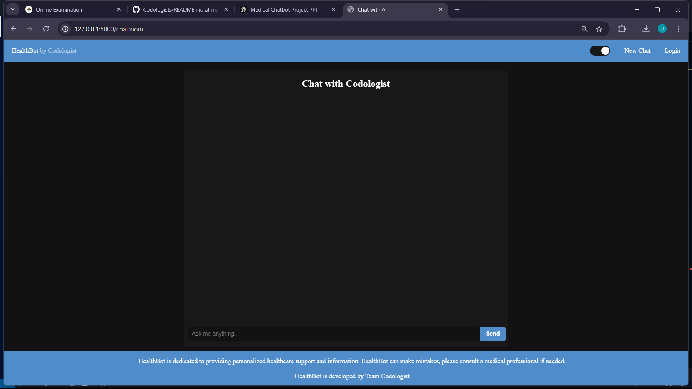
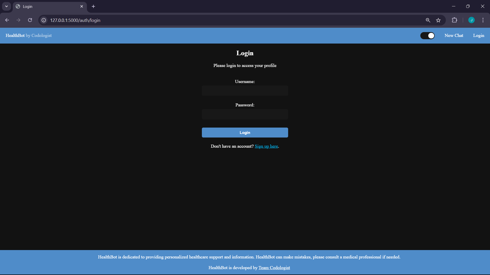

# **Medical Chatbot Project**

## **Overview**
The **Medical Chatbot** is an AI-powered application designed to provide accurate and relevant medical advice to users. The chatbot processes data from a medical PDF, converts it into embeddings, stores it in a vector database, and retrieves the most relevant responses to user queries using the **LLAMA2 Generative AI model**. The application features a secure user authentication system, intuitive frontend design, and seamless backend integration.

---

## **Features**
- **Data Handling:** Extracts data from medical PDFs, processes it into embeddings, and stores it in a vector database.
- **AI Query Processing:** Uses LLAMA2 for natural language understanding and accurate responses.
- **Secure Login:** User authentication is managed with **MongoDB**.
- **Responsive Interface:** User-friendly design with seamless interaction.
- **Scalable and Modular Design:** Ready for future upgrades.

---

## How the Interface Looks

### Chatroom


### Login



---

## **Technologies Used**
### **Backend:**
- Flask
- LangChain
- Pinecone
- MongoDB
- cTransformers

### **Frontend:**
- HTML
- CSS
- JavaScript

### **Machine Learning:**
- Sentence Transformers
- LLAMA2 Generative AI

---

## **System Requirements**

### **Operating System:**
- Windows 10 or later

### **Hardware:**
- **RAM:** Minimum 8 GB
- **Storage:** 10 GB Free Space
- **Processor:** Intel i5 or equivalent

---

## **Installation Guide**

### **1. Clone the Repository**
Run the following command to clone the repository:
```bash
git clone https://github.com/your-username/medical-chatbot.git
cd medical-chatbot
```

### **2. Create a Python Virtual Environment**
Set up a virtual environment to manage dependencies:
```bash
python -m venv venv
```

Activate the virtual environment:
- **Windows:**
  ```bash
  venv\Scripts\activate
  ```
- **Mac/Linux:**
  ```bash
  source venv/bin/activate
  ```

### **3. Install Required Libraries**
Install all necessary dependencies listed in `requirements.txt`:
```bash
pip install -r requirements.txt
```

### **4. Run the Application**
Start the Flask server:
```bash
flask run
```

---

## **Usage Instructions**
1. **Login:** Use your email ID and password to access the chatbot.
2. **Query:** Ask any medical-related question.
3. **Response:** Receive accurate and relevant answers based on the dataset.

---

## **Manual Testing**
The chatbot has been manually tested for:
- **Query Handling:** Various medical queries for accuracy.
- **Response Speed:** Quick retrieval of information from Pinecone.
- **UI Interactions:** Smooth user experience on the frontend.

---

## **Future Scope**
- Expanding the dataset to include more medical conditions.
- Integration with real-time medical databases for live updates.
- Enhancing the chatbot's conversational capabilities with more advanced AI models.

---

